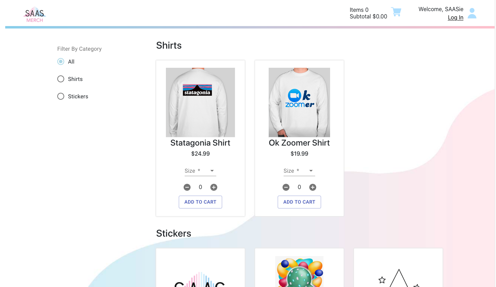
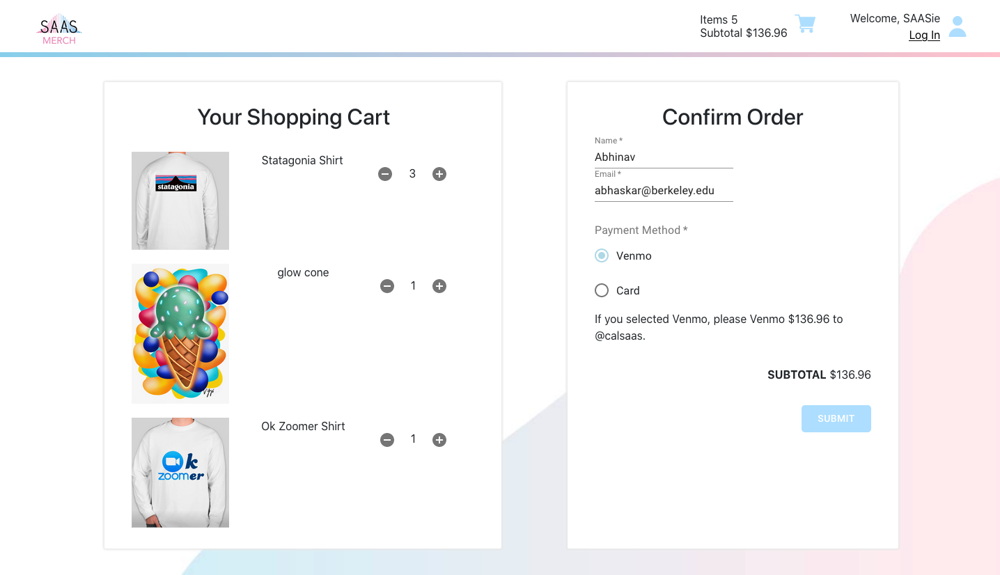

## The Official Student Association for Applied Statistics's Merchandise Shop
## Made By Abhinav Bhaskar, Rachel Li, Valerie Yip  

This project was a collaboration between three generations of SAAS's Web Development Directors, created during the semester of COVID-19 in an effort to streamline our merchandise selling process.  

The project thus far includes basic features of an ecommerce site. A admin page and user home will be added in the future.  

The project uses React, Redux, Firebase, Stripe API, ES6+  

*Note the items displayed are not actually for sale*  

## Usage
There are two package.json files, one in the root directory and one inside client/. Install both sets of dependencies.  

Run `npm run build` inside the root directory. This will cd inside the client folder and build the frontend. The build folder will be omitted from github due to size.  
Then you will be able to start the server by typing `npm run dev` again in the root directory which will run the server at http:/localhost:5000.  
When adding a stripe API Key, create a `.env` file and paste `STRIPE_SECRET_KEY=YOUR_SECRET_KEY_ID`. Keys should not be stored on git for security reasons.

## Images

This project was bootstrapped with [Create React App](https://github.com/facebook/create-react-app).
Use npm start, test, run build. Do not run eject
